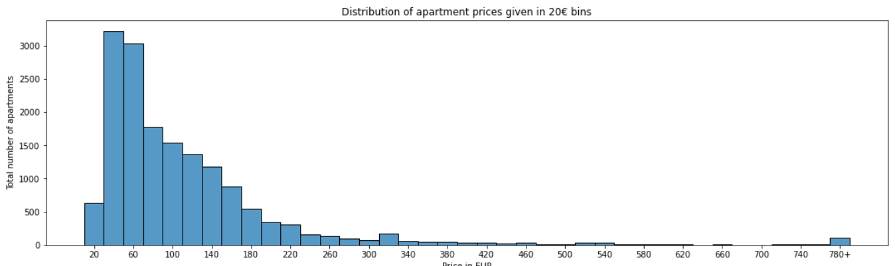

# AirBnB Barcelona Visualization #

A visualization for AirBnB data of Barcelona from Oct 2021 to Oct 2022 done for the JKU course Visual Analytics.

## General info ##

AirBnB is a wonderful plattform for finding cheap or well-located places to stay in other cities aside from hotel chains. But wouldn't it be interessting to take a deeper dive into the data behind AirBnB, in this example the Spanish city Barcelona? Why not get a feeling on where apartments are abailable throughout the city, how expensive they are and where you might find another AirBnB-user?

## Technologies ##

The whole program is written in python (3.9 and 3.10), but should typically run on anything newer than 3.6. To install the needed packages, see later on in setup, the distribution anaconda is used.

## Setup ##

First, clone this repository to your machine and change the directory into it. Feel free to choose any location on your machine you like and whether your prefer https or ssh for cloning. Obviously you may choose a GUI git application, but some of the following steps need to be executed on a terminal level.

```bash
git clone https://github.com/Stern1710/airbnb-barcelona-visualization.git
git clone git@github.com:Stern1710/airbnb-barcelona-visualization.git
```

Due to limitations with the file size git can store, `calendar.csv` is still in a packed format, `calendar.csv.gz`. You need to unpack it, otherwise computations will fail with an error message indicating it could not find the calendar.csv file. A program like 7-zip can do the unpacking.

Several packages have to be installed in order for this to work correctly. The environment anaconda (more specifically miniconda) was used during programming, so it is recommended to install this distribution as well. Open the conda prompt, navigate to the projects root folder and create the environment `airbnb-barcelona` from the `environment.yml` file.

```bash
conda env create -f environment.yml
```

Next, activate the created environment

```bash
conda activate python-tutorial
```

Last of all, install jupyter lab

```bash
jupyter labextension install @jupyter-widgets/jupyterlab-manager
```

To launch jupyter lab:

```bash
jupyter lab
```

Jupyter should open a new tab with url <http://localhost:8888/> and display the files.

## Features ##

There are various forms of analysis done, including static ones such as distrubtions, box plots, and geoplotting. It also takes a look into correlation between different features like the districts, their average prices etc. Also advanced forms of data anlysis are available through PCA and k-Means clustering.




## Credits ##

This project was a group effort of four people. Big thanks to [Christopher Holzweber](https://github.com/holzweber), [Clemens Mayr](https://github.com/mayr597) and [Michael Casta](https://github.com/micasta).
